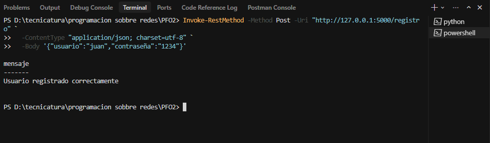
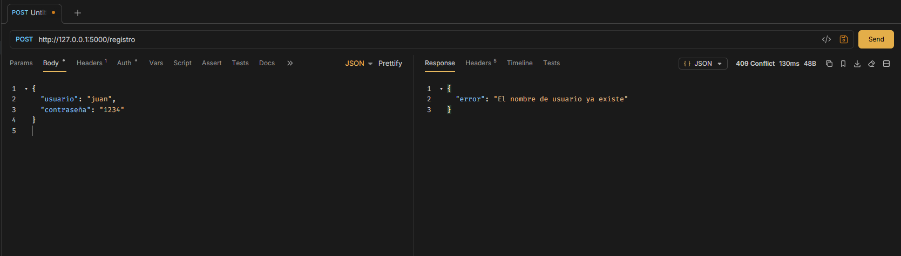
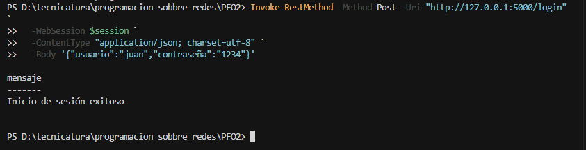
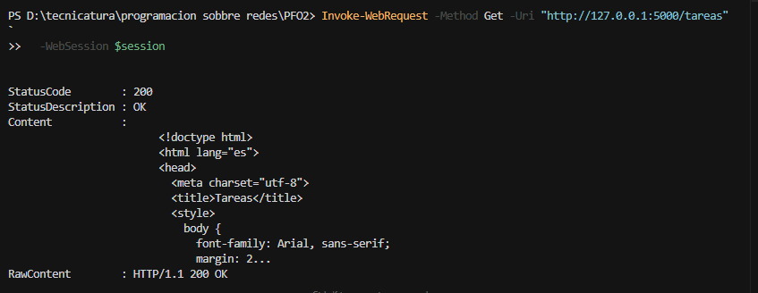
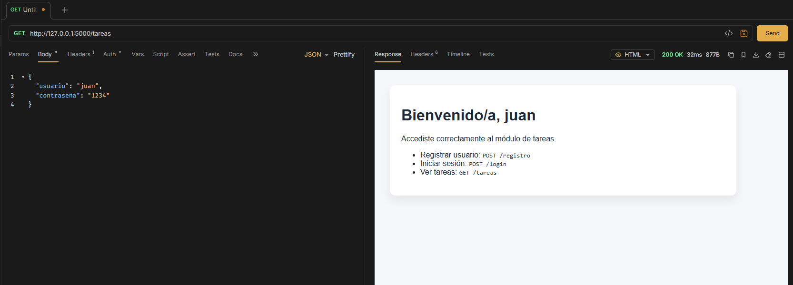

# Servidor Flask: Registro, Login y Tareas

Este proyecto implementa un servidor con:

- `POST /registro`: registra usuarios con contraseña hasheada.
- `POST /login`: valida credenciales e inicia sesión.
- `GET /tareas`: devuelve un HTML de bienvenida para usuarios autenticados.

La persistencia de datos se realiza con SQLite (`usuarios.db`).

## Requisitos

- Python 3.10+ (o compatible)
- pip

## Instalación y ejecución

> Nota: para este PFO, el entorno virtual no es obligatorio. Se incluye como buena práctica recomendada.

1. Crear entorno virtual (opcional, recomendado):

```bash
python -m venv .venv
```

2. Activar entorno virtual:

- En Windows (PowerShell):

```bash
.venv\Scripts\Activate.ps1
```

3. Instalar dependencias:

```bash
pip install flask werkzeug
```

4. Ejecutar el servidor:

```bash
python servidor.py
```

### Configurar SECRET_KEY (recomendado)

Antes de ejecutar el servidor, define una clave de sesión segura por variable de entorno.

En Windows PowerShell:

```bash
$env:SECRET_KEY="una_clave_larga_y_aleatoria"
python servidor.py
```

5. El servidor quedará disponible en:

`http://127.0.0.1:5000`

## Pruebas de endpoints

### 1) Registro de usuario

```bash
curl -X POST http://127.0.0.1:5000/registro ^
  -H "Content-Type: application/json" ^
  -d "{\"usuario\":\"juan\",\"contraseña\":\"1234\"}"
```

Respuesta esperada:

- `201 Created`
- `{"mensaje":"Usuario registrado correctamente"}`

### 2) Login

```bash
curl -c cookies.txt -X POST http://127.0.0.1:5000/login ^
  -H "Content-Type: application/json" ^
  -d "{\"usuario\":\"juan\",\"contraseña\":\"1234\"}"
```

Respuesta esperada:

- `200 OK`
- `{"mensaje":"Inicio de sesión exitoso"}`

### 3) Acceso a tareas (HTML)

```bash
curl -b cookies.txt http://127.0.0.1:5000/tareas
```

Respuesta esperada:

- `200 OK`
- HTML con mensaje de bienvenida.

Si se prueba sin login, devuelve:

- `401 Unauthorized`
- `{"error":"Debes iniciar sesión para acceder a las tareas"}`

## Capturas de pantalla (entregable)

Para completar el entregable, agrega en este repositorio una carpeta `capturas/` con imágenes de:

1. Registro exitoso (`/registro`).
2. Login exitoso (`/login`).
3. Acceso a `/tareas` mostrando el HTML de bienvenida.

Luego, en este README, puedes referenciarlas así:

## Capturas de pruebas

### Registro exitoso



### Login exitoso


### Acceso a tareas





GitHub Pages es para contenido estático (HTML/CSS/JS). Esta API Flask no corre directamente en Pages.


## Respuestas conceptuales

### ¿Por qué hashear contraseñas?

Hashear contraseñas evita guardar claves reales en texto plano. Si hay una filtración de base de datos, un atacante no obtiene la contraseña directamente, sino un hash difícil de revertir. Esto reduce el impacto de un compromiso y mejora la seguridad del sistema.

### Ventajas de usar SQLite en este proyecto

- Es liviano y no requiere instalar un servidor de base de datos aparte.
- Es ideal para proyectos educativos, prototipos y aplicaciones pequeñas/medianas.
- Su integración con Python es simple (`sqlite3` viene en la librería estándar).
- Facilita la persistencia local en un único archivo (`usuarios.db`), lo que simplifica despliegue y backups básicos.
